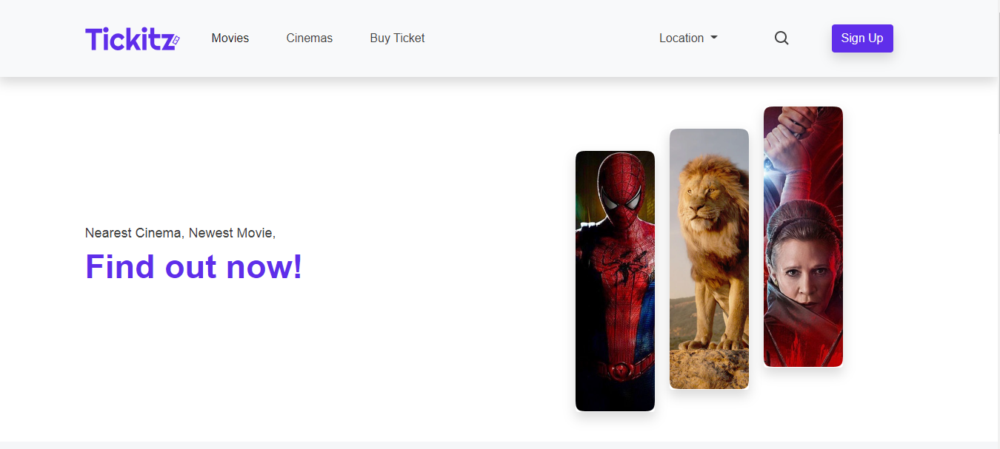

<h1 align='center'>CinemArs Ticket Booking</h1>
  

    <a href="https://cinemarsticketbooking.netlify.app/">View Demo</a>
    ·
    <a href="https://github.com/arsasf/CinemArs_Ticket_Booking/issues">Report Bug</a>
    ·
    <a href="https://github.com/arsasf/CinemArs_Ticket_Booking/pulls">Request Feature</a>
  

## About The Projectgit

CinemArs Ticket Booking is a website-based online movie theater ticket booking system. Offline ticket purchases require buyers to queue. Sometimes buyers have to queue up to several hours to watch their favorite movie and successfully buy a ticket, there are also those who run out of tickets after queuing for a long time. In terms of officers serving tickets offline it is also quite difficult. Officers have to manually enter the amount of data for each purchase into their system and allow incorrect data entry.To solve this problem, I created a website-based online ticket booking system. Where the way to buy tickets is practical, not to come to the movie theater and queue for a long time. Buyers only need to access this website from their mobile phone and order the ticket. In addition, buyers can also see information on the film being shown and seat selection. The officer just needs to check the data from the ticket purchase ordered whether it is appropriate or not.

## Built With

## Getting Started

1. Download this Project or you can type `git clone #https://github.com/arsasf/CinemArs_Ticket_Booking.git`
2. Open app's directory with your browser

## License

© [Aulia Safitri](https://github.com/arsasf/)
